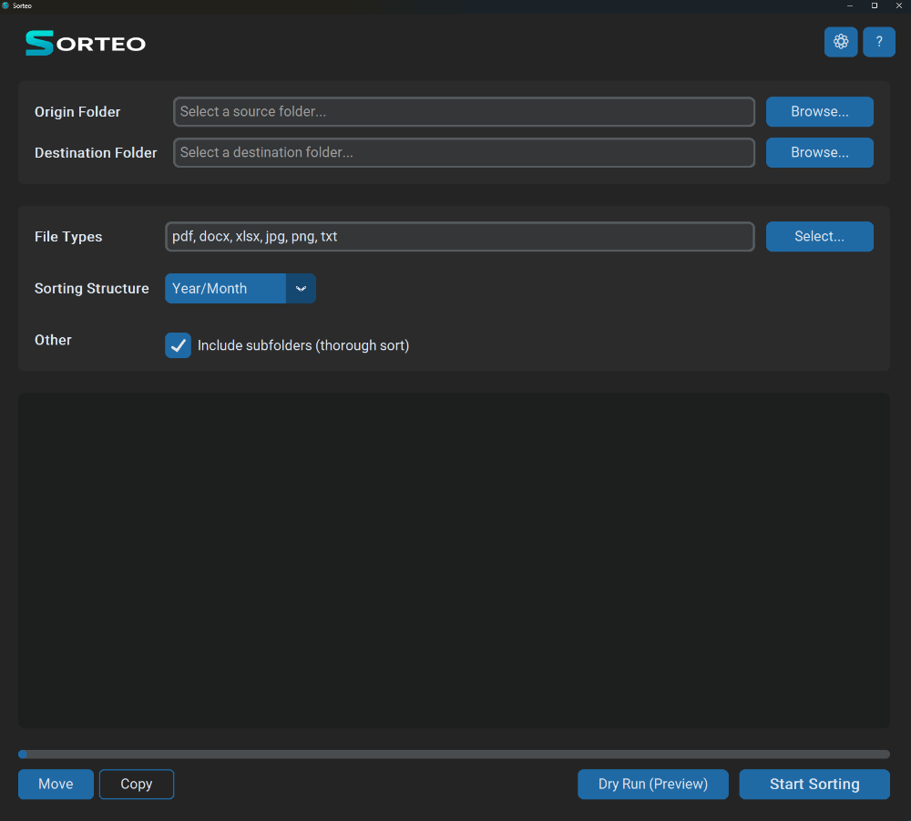

# Sorteo 📂

  A simple, modern, and powerful desktop utility to help you organize your digital files into clean, structured folders.

---

## About The Project

Sorteo was built to solve a common problem: digital clutter. Whether it's a messy "Downloads" folder or a chaotic collection of project files, Sorteo provides an easy-to-use interface to sort your files based on rules you define. Its goal is to turn chaos into order in just a few clicks.

### ## Key Features ✨

- **Flexible Sorting:** Organize files by `Year/Month`, `File Type`, or create your own custom folder structures.
- **Safe Operations:** Perform a **Dry Run** to preview exactly where your files will go before committing to a move or copy.
- **Move or Copy:** Choose to either move files to their new home or simply create an organized copy, leaving the original files untouched.
- **Deep Cleaning:** Optionally include all subfolders in the sorting process for a thorough organization.
- **Modern UI:** A clean, sleek interface built with a customizable dark/light theme.

### ## Built With

This project is composed of two main parts: the desktop application and the promotional website.

- **Sorteo Application:**
  - 
  - 
- **Promotional Website:**
  - 
  - 
  - 

---

## Getting Started

To get a copy of Sorteo up and running, please visit our official website for the latest version.

### ### Installation

1.  Navigate to the [**Official Sorteo Website**](https-placeholder-for-your-website-url).
2.  Click the **Download** button to get the installer or `.zip` file.
3.  Run the installer or unzip the folder and launch **Sorteo.exe**.

---

## Usage

Using Sorteo is designed to be as simple as possible:

1.  **Select Folders:** Choose an **Origin Folder** (where your messy files are) and a **Destination Folder** (where you want the sorted files to go).
2.  **Choose Rules:** Select the file types you want to sort and pick a folder structure from the dropdown menu.
3.  **Start Sorting:** Choose your operation (`Move`, `Copy`, or `Dry Run`) and click the "Start Sorting" button.

---

## Contributing

Contributions are what make the open-source community such an amazing place to learn, inspire, and create. Any contributions you make are **greatly appreciated**.

If you have a suggestion that would make this better, please fork the repo and create a pull request. You can also simply open an issue with the tag "enhancement".

1.  Fork the Project
2.  Create your Feature Branch (`git checkout -b feature/AmazingFeature`)
3.  Commit your Changes (`git commit -m 'Add some AmazingFeature'`)
4.  Push to the Branch (`git push origin feature/AmazingFeature`)
5.  Open a Pull Request

---

## License

Distributed under the MIT License. See `LICENSE.txt` for more information.

---

## Support the Project ❤️

Sorteo is a free and open-source project. If you find it useful, please consider supporting its development. Every little bit helps!

- [**Buy Me a Coffee**](https-placeholder-for-your-donation-link)
- [**GitHub Sponsors**](https-placeholder-for-your-github-sponsors-link)
